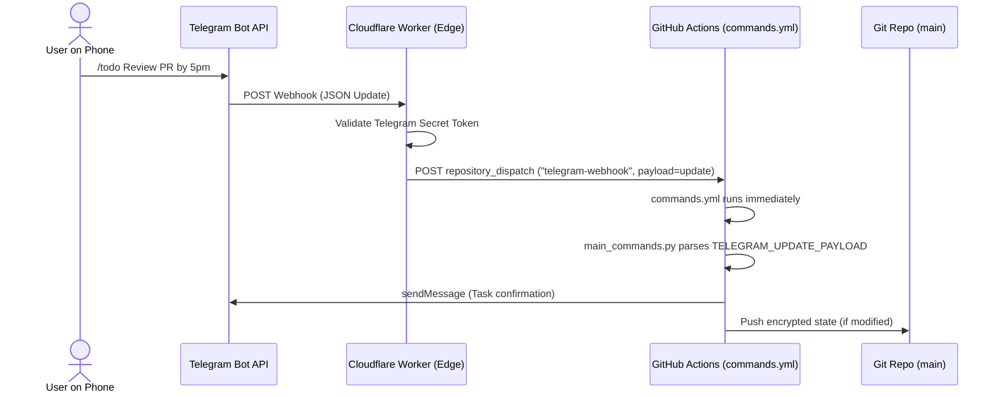
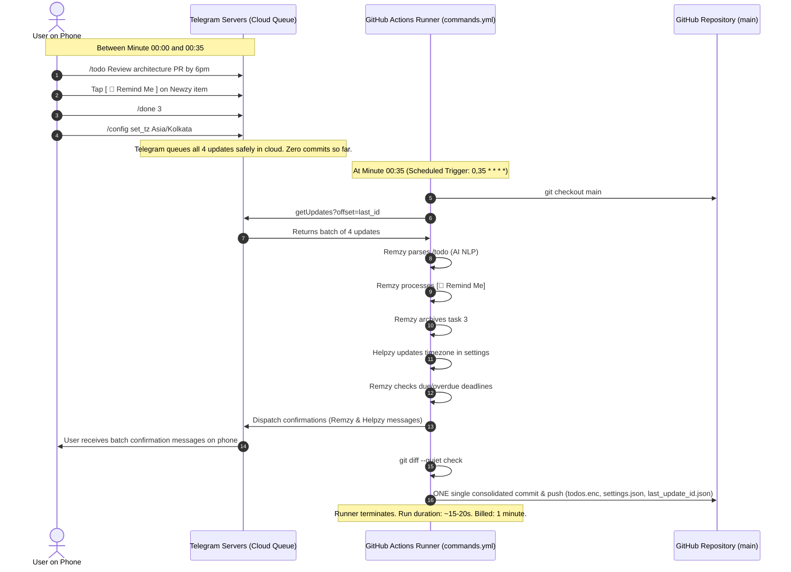

# Architecture — RemNewz: AI Assistant Suite & Open-Source Template

**Related Docs:** [PRD.md](./PRD.md) · [Rules.md](./Rules.md) · [Phases.md](./Phases.md)

---

## 1. System Overview

RemNewz is a serverless, dual-workflow architecture powered by GitHub Actions, communicating over HTTPS with the Telegram Bot API and pluggable AI providers. It operates with zero persistent servers, using Git as an auditable, versioned persistence layer.

```mermaid
graph TD
    subgraph GitHub Actions Scheduled Environment
        DW[digest.yml<br/>8:00 AM UTC & On-Demand] -->|Fetch Repos & Feeds| FEAT[Fetchers: GitHub / RSS / HN]
        FEAT -->|Filter Candidates & Apply Weights| SEEN[data/seen.enc<br/>21d / 1500 Cap]
        FEAT -->|Synthesize Insights| AI[AI Engine: Pluggable Multi-Provider<br/>Gemini / OpenRouter / Groq]
        AI -->|Format HTML & Buttons| NEWZY[Persona: Newzy Digest]
        NEWZY -->|sendMessage| TG[Telegram Servers]

        CW[commands.yml<br/>30-35m Private / 5m Public / Webhook] -->|getUpdates & Callbacks| TG
        TG -->|Poll Updates Queue| ROUTER[Command Router & Allowlist]
        ROUTER -->|NLP /todo| REMZY[Persona: Remzy Tasks]
        ROUTER -->|Inline [📌 Remind]| REMZY
        ROUTER -->|Feedback [👍] [👎]| NEWZY_LEARN[Feed Preference Learning]
        ROUTER -->|/config & /source Settings| HELPZY[Persona: Helpzy Config]
        ROUTER -->|/digest & /news| NEWZY
        REMZY -->|Check Deadlines| CHECKER[Due & Overdue Checker]
        CHECKER -->|Smart Nudge to Origin Topic| TG
        NEWZY -->|Route to #News Topic| TG
        
        REMZY -->|Mutate| STORE[Storage Subsystem<br/>Fernet Encrypted / Plain JSON]
        HELPZY -->|Mutate| SETTINGS[data/settings.enc]
        NEWZY_LEARN -->|Update Weights| SETTINGS
        
        MW[maintenance.yml<br/>Monthly Squash Cron] -->|Consolidate State Commits| SQUASH[Squash History into 1 Commit]
    end

    subgraph Dual-Branch Persistence Model
        GIT_MAIN[(Git Branch: 'main'<br/>Application Code & Docs<br/>Zero Bot Clutter)]
        GIT_DATA[(Git Branch: 'data'<br/>Encrypted State Files<br/>Auto-Provisioned & Squashed)]
        
        CW -.->|Checked out via Git Worktree| GIT_DATA
        DW -.->|Checked out via Git Worktree| GIT_DATA
        STORE -->|Batched Commits to 'data'| GIT_DATA
        SEEN -->|Batched Commits to 'data'| GIT_DATA
        SETTINGS -->|Batched Commits to 'data'| GIT_DATA
        SQUASH -->|Force Push 1 Snapshot Commit| GIT_DATA
    end

    TG <===> USER((User on Phone))
```

> **Detailed Architecture Diagrams:** For comprehensive Mermaid sequence diagrams, state machines, and system flowcharts, see [structures.md](./structures.md).

---

## 2. Repo Layout

```text
remnewz/
├── .github/
│   └── workflows/
│       ├── digest.yml              # Daily scheduled digest (08:00 UTC) & manual trigger
│       ├── commands.yml            # Batched commands (poller & webhook dispatcher)
│       ├── register_commands.yml   # Automatic 4-scope Telegram command registration
│       └── maintenance.yml         # Monthly maintenance squashing data branch to 1 commit
├── config.example.yml              # Base template configuration (topics, feeds, timezone, style)
├── data/                           # In git: tracked as dedicated 'data' branch via git worktree
│   └── __init__.py                 # On 'main': only __init__.py exists (zero personal .enc files)
│                                   # On 'data' branch:
│                                   # ├── seen.enc (dedup history: 21 days / 1500 items)
│                                   # ├── todos.enc (active tasks, encrypted at rest)
│                                   # ├── archive_todos.enc (completed tasks capped at 50)
│                                   # ├── settings.enc (dynamic settings & feedback weights)
│                                   # └── last_update_id.enc (update high-water mark)
├── docs/
│   ├── user_guide.md               # User guide & command reference
│   ├── repo_modes_guide.md         # Public vs Private repository guide
│   └── cloudflare_worker_guide.md  # Zero-polling webhook proxy setup guide
├── engine/
│   ├── ai_client.py                # Multi-provider client (Gemini, OpenRouter, Groq with dynamic models)
│   ├── crypto.py                   # Fail-secure Fernet AES-128-CBC encryption at rest
│   ├── dedup.py                    # URL normalization and deduplication store
│   ├── store.py                    # Atomic file I/O and encrypted storage manager
│   └── time_utils.py               # Timezone-aware date parsing and formatting
├── fetchers/
│   ├── github_repos.py             # Authenticated GitHub Search API fetcher (>250/7d, >1200/30d)
│   └── rss_hn.py                   # RSS feeds (top 10 items) + Hacker News API fetcher
├── personas/
│   ├── newzy.py                    # Digest synthesis, adaptive styling & interactive buttons
│   ├── remzy.py                    # NLP task parser, deadline evaluator & anti-spam nudger
│   └── helpzy.py                   # In-chat /config dispatcher & settings manager
├── notifier/
│   └── telegram.py                 # Telegram Bot API wrapper (HTML parse mode & 4KB chunker)
├── scripts/
│   ├── register_commands.py        # Pushes commands to Telegram across all 4 standard scopes
│   └── cf_worker_proxy.js          # Cloudflare Worker webhook proxy script
├── tests/                          # Automated pytest test suites
├── Project Docs/
│   ├── Architecture.md             # System architecture & component breakdown
│   ├── PRD.md                      # Product requirements document
│   ├── Rules.md                    # Technical boundaries & conventions
│   ├── Phases.md                   # Build roadmap & verification checkpoints
│   └── structures.md               # Centralized Mermaid architecture diagrams
├── main_digest.py                  # Entrypoint for digest.yml and on-demand /digest /news
├── main_commands.py                # Entrypoint for commands.yml
├── requirements.txt                # Lightweight dependencies
└── README.md                       # Open-source template documentation & setup guide
```

---

## 3. Technology Stack

- **Runtime:** Python 3.11+ on GitHub Actions (`ubuntu-latest`).
- **External APIs:**
  - **Telegram Bot API:** HTTPS REST interface (`getUpdates`, `sendMessage`, `answerCallbackQuery`, `setMyCommands`).
  - **Pluggable AI Providers:**
    - Google Gemini (`gemini-2.0-flash` / `gemini-1.5-flash` — structured output support).
    - OpenRouter (Dynamic routing across free and community model endpoints).
    - Groq (High-speed inference for supported free-tier models).
  - **GitHub Search API:** Authenticated via standard `${{ secrets.GITHUB_TOKEN }}`.
- **Python Dependencies:** `requests`, `feedparser`, `pyyaml`, `python-dateutil`, `cryptography` (for encryption).

---

## 4. Key Architectural Subsystems

### 4.1 Pluggable AI Client & Adaptive Feed Personalization

- **Provider Abstraction (`engine/ai_client.py`):**
  - Reads `AI_PROVIDER`, `AI_MODEL`, and `AI_API_KEY` from environment variables / secrets.
  - Zero Hardcoded Models: Users can specify any valid model identifier (e.g. `gemini-2.0-flash`, `llama-3.3-70b-versatile`, or an OpenRouter model string) via `AI_MODEL`.
  - Normalizes prompts and structured JSON outputs across Gemini, OpenRouter, and Groq.
  - Normalizes canonical slugs for GitHub topic queries (e.g., lowercase alphanumeric with hyphens).
  - Gracefully degrades to rule-based formatting and regex date parsing if no AI provider is configured.
- **Adaptive Feed Learning:**
  - Users can configure `digest_style`: `"concise"`, `"deep_dive"`, `"technical"`, or `"bullet_points"`.
  - News items carry `[ 👍 ]` and `[ 👎 ]` callback buttons.
  - Tapping feedback records tag weights in `data/settings.enc` (`preferred_tags`, `suppressed_tags`).
  - Future candidate ranking boosts preferred tags and filters out suppressed tags before sending to the AI synthesis step.

### 4.2 Supergroup Topic Routing & Thread Retention

When RemNewz is used in a Telegram Supergroup with Topics (Forums) enabled, users can organize and isolate message streams:
- **News Topic (`topic_news`):** Bound via `/config bind_news` (inside the desired topic) or `/config set_topic_news <id>`. All scheduled digests and `/digest` syntheses are routed to this thread ID.
- **Tasks Topic (`topic_tasks`):** Bound via `/config bind_tasks` (inside the desired topic) or `/config set_topic_tasks <id>`. Proactive due alerts and overdue nudges flow into this designated thread.
- **Origin Thread Retention:** When `/todo` is called within an unbound topic thread, Remzy stores `origin_thread_id` inside the task object. If no global `topic_tasks` is bound, Remzy delivers due notifications directly back into that specific origin thread, keeping conversation context intact.
- **Unbound/1-on-1 Fallback:** If topic routing is not used or cleared via `/config clear_topics`, `message_thread_id` resolves to `None`, directing messages to standard 1-on-1 chat or the supergroup General channel.

### 4.3 Dual-Branch Storage & Privacy Subsystem

RemNewz decouples **Application Code** from **Encrypted State** through a dual-branch architecture:

1. **Clean `main` Branch (Zero Commit Clutter):**
   - The `main` branch contains strictly application code, documentation, and feature commits.
   - All `data/*.enc` files are untracked on `main` and ignored via `.gitignore`.
   - When a user imports or forks the template, `main` contains zero personal encrypted database files from the creator.
2. **Dedicated `data` Branch (Serverless Database):**
   - Encrypted state files (`todos.enc`, `archive_todos.enc`, `settings.enc`, `seen.enc`, `last_update_id.enc`) are committed exclusively to the orphan branch `data`.
   - In GitHub Actions runners, the `data` branch is dynamically mounted to the local `data/` path using `git worktree add data data`.
   - Bot sync commits (`chore(sync): update tasks and settings [skip ci]`) advance **only** the `data` branch.
3. **Template Auto-Provisioning (Zero Setup for New Users):**
   - When a new user instantiates the template, GitHub only copies the default `main` branch.
   - On the very first run of `commands.yml` or `digest.yml`, the runner checks if `origin/data` exists.
   - If not found, it automatically initializes an orphan branch `data`, pushes it to `origin data`, and mounts it without requiring any manual setup from the user.
4. **Monthly Maintenance Squash (`maintenance.yml`):**
   - On the 1st of every month, an automated workflow squashes historical state commits on the `data` branch into a single clean snapshot commit (`chore(maintenance): monthly state consolidation [skip ci]`).
   - Keeps the repository lightweight and permanently prevents history bloat.
5. **Encrypted Mode (Fernet / AES-128-CBC with SHA256 HMAC):**
   - When `ENCRYPTION_KEY` is provided, `engine/crypto.py` transparently encrypts all sensitive data before disk write.
   - Decryption occurs only in runner memory. If `ENCRYPTION_KEY` is invalid or corrupted, `CryptoManager` fails securely by raising `RuntimeError` rather than leaking plaintext.
6. **Atomic Writes & Zero Corruption:**
   - File writes use `_atomic_write_file`: data is flushed to `.tmp` files, synced via `os.fsync`, and atomically moved into place using `os.replace`.


### 4.4 Git Concurrency & Conflict Prevention
Because `digest.yml` and `commands.yml` run independently, simultaneous runs could cause git push rejections. RemNewz mitigates this through two layers:
1. **Repository Concurrency Group:**
   ```yaml
   concurrency:
     group: git-state-storage
     cancel-in-progress: false
   ```
   Ensures workflows queue sequentially rather than executing git pushes simultaneously.
2. **Resilient Pull-Rebase Loop:**
   Before pushing, the runner executes:
   ```bash
   git pull --rebase origin main
   git push origin main
   ```
   with exponential backoff (up to 3 retries).

### 4.5 Cloudflare Worker Webhook Dispatch (Instantaneous Webhook Architecture)

For users running on private repositories who want immediate command processing without exhausting GitHub Actions minutes, RemNewz supports an event-driven webhook pipeline:



- **Zero Idle Runner Waste:** Runners only spin up when a message is actually sent.
- **Fast Execution:** Sub-second dispatch from Cloudflare to GitHub runner.
- **Dual Compatibility:** `main_commands.py` automatically checks for `TELEGRAM_UPDATE_PAYLOAD`; if absent, it falls back seamlessly to long-polling `getUpdates`.

---

## 5. End-to-End User Interaction Flow & Batching Mechanics

A common question is: *What happens every time I add a task, check off a to-do, click a button, or change a setting? Does every action immediately commit to GitHub?*

### 5.1 The Telegram Queue Model (Zero Constant Commits)
GitHub Actions is not an always-on server; it runs on a periodic batch schedule. Telegram acts as a persistent message buffer:



### 5.2 What Exactly Happens During the 35-Minute Cycle?
1. **Batch Ingestion:** All interactions sent during the preceding 35-minute window are fetched from Telegram in a single HTTP request.
2. **Chronological Processing:** Commands are resolved in exact order of arrival.
3. **Consolidated Confirmation:** The bot dispatches reply messages back to your Telegram chat.
4. **Deadline Evaluation:** Scans tasks in `todos.enc`:
   - If a task is due (`now >= due_at`) and has not been notified $\to$ fires a due alert.
   - If a task is overdue and $\ge 24$ hours have passed since the last alert $\to$ fires a single overdue snooze nudge.
5. **Single Batched Commit:** If and only if data changed, the runner stages the updated files, writes **one single commit** (e.g., `chore(sync): update tasks and settings [skip ci]`), and pushes back to `main`. If no commands were sent and no tasks became due, **zero commits are made**.

### 5.3 Git and Repository Policies
- **No Commit Frequency Limits:** GitHub enforces **no limits on the number of commits** on either public or private repositories.
- **Actions Minutes Quota:** GitHub allocates **2,000 minutes/month** on private repos. Running at 35-minute intervals (`0,35 * * * *`) runs twice an hour ($\approx 1,440$ minutes/month across 24h), fitting safely within the free allowance.
- **Privacy via Encryption:** Because all state is stored directly in the git repository (to leverage GitHub as a free backend), it is vital that personal task data remains private even if the repository is public. A symmetric Fernet encryption key (`ENCRYPTION_KEY`) encrypts `.enc` files at rest, ensuring that no plaintext to-dos or private notes are exposed in the commit history.
- **Latency Expectation:** Commands are responded to during the next sync window. If an immediate response is ever needed, the user can tap "Run workflow" in GitHub Mobile, or trigger a manual dispatch.

---

## 6. External Boundaries & Failure Modes

| Component | Failure Mode | Mitigation |
|---|---|---|
| **AI Provider** | Quota exceeded, outage, or timeout | Fall back gracefully to deterministic RSS/README title summaries and regex date parsing. Zero crash. |
| **GitHub Search API** | Rate limit on shared runner IPs | Inject `${{ secrets.GITHUB_TOKEN }}` for 1,000 req/hr rate limit. |
| **Telegram Bot API** | HTML formatting error or payload $> 4,096$ chars | Strict HTML tag sanitizer; automatic message chunking at paragraph breaks $\le 4,000$ chars. |
| **GitHub Actions Cron** | Runner delay or skipped cron execution | Remzy checks `due_at <= now` rather than exact timestamp match; overdue nudges catch missed slots. |
| **Git Push** | Remote rejected (non-fast-forward) | `concurrency` group prevents parallel runs; `git pull --rebase` retry loop recovers from desyncs. |
