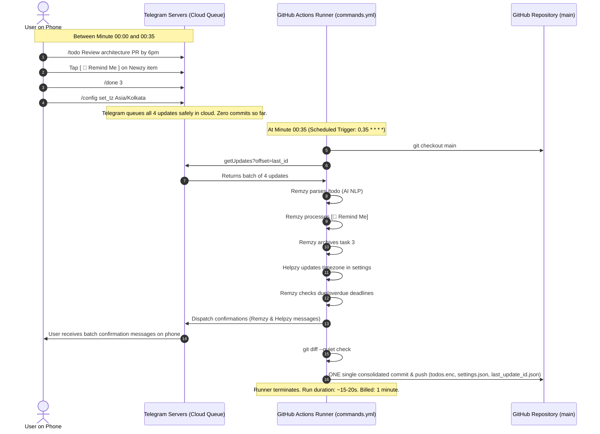

# Architecture — RemNewz: AI Assistant Suite & Open-Source Template

**Related Docs:** [PRD.md](./PRD.md) · [Rules.md](./Rules.md) · [Phases.md](./Phases.md)

---

## 1. System Overview

RemNewz is a serverless, dual-workflow architecture powered by GitHub Actions, communicating over HTTPS with the Telegram Bot API and pluggable AI providers. It operates with zero persistent servers, using Git as an auditable, versioned persistence layer.

```mermaid
graph TD
    subgraph GitHub Actions Scheduled Environment
        DW[digest.yml<br/>8:00 AM & 8:00 PM] -->|Fetch Repos & Feeds| FEAT[Fetchers: GitHub / RSS / HN]
        FEAT -->|Filter Candidates & Apply Weights| SEEN[data/seen.json<br/>14d / 1000 Cap]
        FEAT -->|Synthesize Insights| AI[AI Engine: Pluggable Multi-Provider<br/>Gemini / OpenRouter / Groq]
        AI -->|Format HTML & Buttons| NEWZY[Persona: Newzy Digest]
        NEWZY -->|sendMessage| TG[Telegram Servers]

        CW[commands.yml<br/>35 min Private / 3-5 min Public] -->|getUpdates & Callbacks| TG
        TG -->|Poll Updates Queue| ROUTER[Command Router & Allowlist]
        ROUTER -->|NLP /todo| REMZY[Persona: Remzy Tasks]
        ROUTER -->|Inline [📌 Remind]| REMZY
        ROUTER -->|Feedback [👍] [👎]| NEWZY_LEARN[Feed Preference Learning]
        ROUTER -->|/config Settings| HELPZY[Persona: Helpzy Config]
        REMZY -->|Check Deadlines| CHECKER[Due & Overdue Checker]
        CHECKER -->|Smart Nudge| TG
        
        REMZY -->|Mutate| STORE[Storage Subsystem<br/>Plain JSON or Fernet Encrypted]
        HELPZY -->|Mutate| SETTINGS[data/settings.json]
        NEWZY_LEARN -->|Update Weights| SETTINGS
    end

    subgraph Persistence Layer (Git Repo)
        STORE -->|Single Batched Commit & Rebase| GIT[(Git Repository: main)]
        SEEN -->|Single Batched Commit & Rebase| GIT
        SETTINGS -->|Single Batched Commit & Rebase| GIT
    end

    TG <===> USER((User on Phone))
```

---

## 2. Repo Layout

```
remnewz/
├── .github/
│   └── workflows/
│       ├── digest.yml              # Runs at 8:00 AM & 8:00 PM (localized)
│       └── commands.yml            # Batched commands (35-min private / 3-5 min public) & checks deadlines
├── config.example.yml              # Base template configuration (topics, feeds, timezone, style)
├── data/
│   ├── .gitkeep
│   ├── seen.json                   # Deduplication history (auto-pruned: 14 days / 1000 items)
│   ├── todos.json                  # Active tasks (or todos.enc if encrypted)
│   ├── archive_todos.json          # Completed tasks (capped at 50, or archive_todos.enc)
│   ├── settings.json               # Dynamic user overrides set via Helpzy & feedback weights
│   └── last_update_id.json         # High-water mark for Telegram updates
├── engine/
│   ├── ai_client.py                # Multi-provider client (Gemini, OpenRouter, Groq with dynamic models)
│   ├── crypto.py                   # Optional Fernet AES-256 encryption at rest
│   └── time_utils.py               # Timezone-aware date parsing and formatting
├── fetchers/
│   ├── github_repos.py             # Authenticated GitHub Search API fetcher
│   └── rss_hn.py                   # RSS feeds + Hacker News API fetcher
├── personas/
│   ├── newzy.py                    # Digest synthesis, adaptive styling & interactive buttons
│   ├── remzy.py                    # NLP task parser, deadline evaluator & anti-spam nudger
│   └── helpzy.py                   # In-chat /config dispatcher & settings manager
├── notifier/
│   └── telegram.py                 # Telegram Bot API wrapper (HTML parse mode & 4KB chunker)
├── main_digest.py                  # Entrypoint for digest.yml
├── main_commands.py                # Entrypoint for commands.yml
├── requirements.txt                # Lightweight dependencies
└── README.md                       # Open-source template documentation & setup guide
```

---

## 3. Technology Stack

- **Runtime:** Python 3.11+ on GitHub Actions (`ubuntu-latest`).
- **External APIs:**
  - **Telegram Bot API:** HTTPS REST interface (`getUpdates`, `sendMessage`, `answerCallbackQuery`).
  - **Pluggable AI Providers:**
    - Google Gemini (`gemini-2.0-flash` / `gemini-1.5-flash` — 1,500 req/day free, structured output support).
    - OpenRouter (Dynamic routing across free and community model endpoints).
    - Groq (High-speed inference for supported free-tier models such as Qwen and gpt-oss with 8,000 TPM limit).
  - **GitHub Search API:** Authenticated via standard `${{ secrets.GITHUB_TOKEN }}`.
- **Python Dependencies:** `requests`, `feedparser`, `pyyaml`, `python-dateutil`, `cryptography` (for optional encryption).

---

## 4. Key Architectural Subsystems

### 4.1 Pluggable AI Client & Adaptive Feed Personalization

- **Provider Abstraction (`engine/ai_client.py`):**
  - Reads `AI_PROVIDER`, `AI_MODEL`, and `AI_API_KEY` from environment variables / secrets.
  - Zero Hardcoded Models: Users can specify any valid model identifier (e.g. `gemini-2.0-flash`, `qwen/qwen-2.5-coder`, or an OpenRouter model string) via `AI_MODEL`.
  - Normalizes prompts and structured JSON outputs across Gemini, OpenRouter, and Groq.
  - Gracefully degrades to rule-based formatting and regex date parsing if no AI provider is configured.
- **Adaptive Feed Learning:**
  - Users can configure `digest_style`: `"concise"`, `"deep_dive"`, `"technical"`, or `"bullet_points"`.
  - News items carry `[ 👍 ]` and `[ 👎 ]` callback buttons.
  - Tapping feedback records tag weights in `data/settings.json` (`preferred_tags`, `suppressed_tags`).
  - Future candidate ranking boosts preferred tags and filters out suppressed tags before sending to the AI synthesis step.

### 4.2 Storage & Privacy Subsystem

Phases 0–3 use **plain JSON** for simplicity, debuggability, and fast iteration. Encryption is added in Phase 4 once there is real data worth protecting.

1. **Plain JSON Mode (Phases 0–3, default):**
   - `data/todos.json` and `data/archive_todos.json` are readable JSON files committed directly to git.
   - Ideal for private repositories and local development.
2. **Encrypted Mode (Phase 4+, optional):**
   - When `ENCRYPTION_KEY` is provided, `engine/crypto.py` encrypts task files to `todos.enc` / `archive_todos.enc` via **AES-256 (Fernet)** before git commit, and decrypts in runner memory.
   - Standardized across both public and private repos.
3. **Repository Mode Cadence Toggle:**
   - *Public Repositories:* Unlimited Actions minutes allow high-frequency polling (**every 3–5 minutes**).
   - *Private Repositories:* Scheduled at **35-minute intervals** (`0,35 * * * *`) to stay within the 2,000 monthly free minutes quota.

### 4.3 Git Concurrency & Conflict Prevention
Because `digest.yml` and `commands.yml` run independently, simultaneous runs could cause git push rejections. RemNewz mitigates this through two layers:
1. **Repository Concurrency Group:**
   ```yaml
   concurrency:
     group: git-state-storage
     cancel-in-progress: false
   ```
   Ensures workflows queue sequentially rather than executing git pushes simultaneously.
2. **Resilient Pull-Rebase Loop:**
   Before pushing, the runner executes:
   ```bash
   git pull --rebase origin main
   git push origin main
   ```
   with exponential backoff (up to 3 retries).

---

## 5. End-to-End User Interaction Flow & Batching Mechanics

A common question is: *What happens every time I add a task, check off a to-do, click a button, or change a setting? Does every action immediately commit to GitHub?*

### 5.1 The Telegram Queue Model (Zero Constant Commits)
GitHub Actions is not an always-on server; it runs on a periodic batch schedule. Telegram acts as a persistent message buffer:



### 5.2 What Exactly Happens During the 35-Minute Cycle?
1. **Batch Ingestion:** All interactions sent during the preceding 35-minute window are fetched from Telegram in a single HTTP request.
2. **Chronological Processing:** Commands are resolved in exact order of arrival.
3. **Consolidated Confirmation:** The bot dispatches reply messages back to your Telegram chat.
4. **Deadline Evaluation:** Scans tasks in `todos.enc`:
   - If a task is due (`now >= due_at`) and has not been notified $\to$ fires a due alert.
   - If a task is overdue and $\ge 24$ hours have passed since the last alert $\to$ fires a single overdue snooze nudge.
5. **Single Batched Commit:** If and only if data changed, the runner stages the updated files, writes **one single commit** (e.g., `chore(sync): update tasks and settings [skip ci]`), and pushes back to `main`. If no commands were sent and no tasks became due, **zero commits are made**.

### 5.3 Git and Repository Policies
- **No Commit Frequency Limits:** GitHub enforces **no limits on the number of commits** on either public or private repositories.
- **Actions Minutes Quota:** GitHub allocates **2,000 minutes/month** on private repos. Running at 35-minute intervals (`0,35 * * * *`) runs twice an hour ($\approx 1,440$ minutes/month across 24h), fitting safely within the free allowance.
- **High-Frequency Public Option:** In public repos, minutes are unlimited, enabling **3–5 minute** cron schedules with complete encryption-at-rest.
- **Latency Expectation:** Commands are responded to during the next sync window. If an immediate response is ever needed, the user can tap "Run workflow" in GitHub Mobile, or trigger a manual dispatch.

---

## 6. External Boundaries & Failure Modes

| Component | Failure Mode | Mitigation |
|---|---|---|
| **AI Provider** | Quota exceeded, outage, or timeout | Fall back gracefully to deterministic RSS/README title summaries and regex date parsing. Zero crash. |
| **GitHub Search API** | Rate limit on shared runner IPs | Inject `${{ secrets.GITHUB_TOKEN }}` for 1,000 req/hr rate limit. |
| **Telegram Bot API** | HTML formatting error or payload $> 4,096$ chars | Strict HTML tag sanitizer; automatic message chunking at paragraph breaks $\le 4,000$ chars. |
| **GitHub Actions Cron** | Runner delay or skipped cron execution | Remzy checks `due_at <= now` rather than exact timestamp match; overdue nudges catch missed slots. |
| **Git Push** | Remote rejected (non-fast-forward) | `concurrency` group prevents parallel runs; `git pull --rebase` retry loop recovers from desyncs. |
