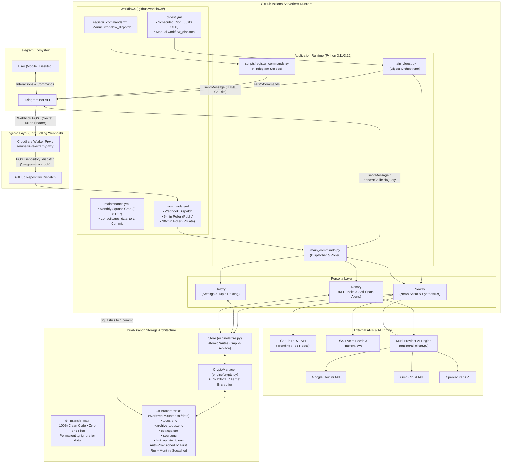
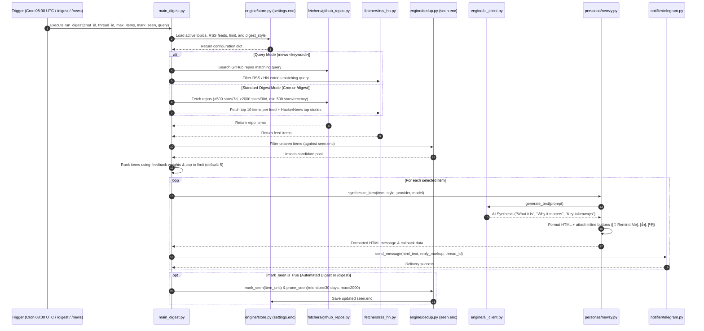
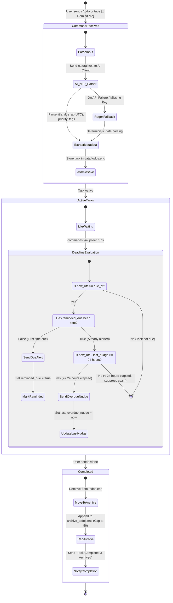
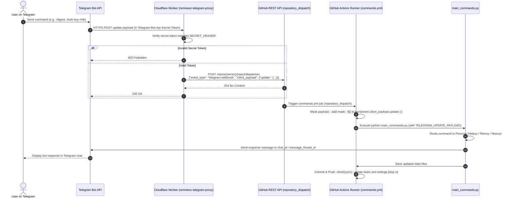
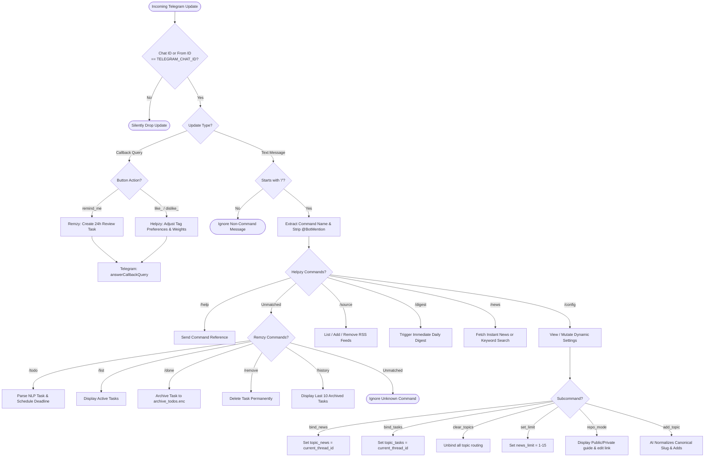
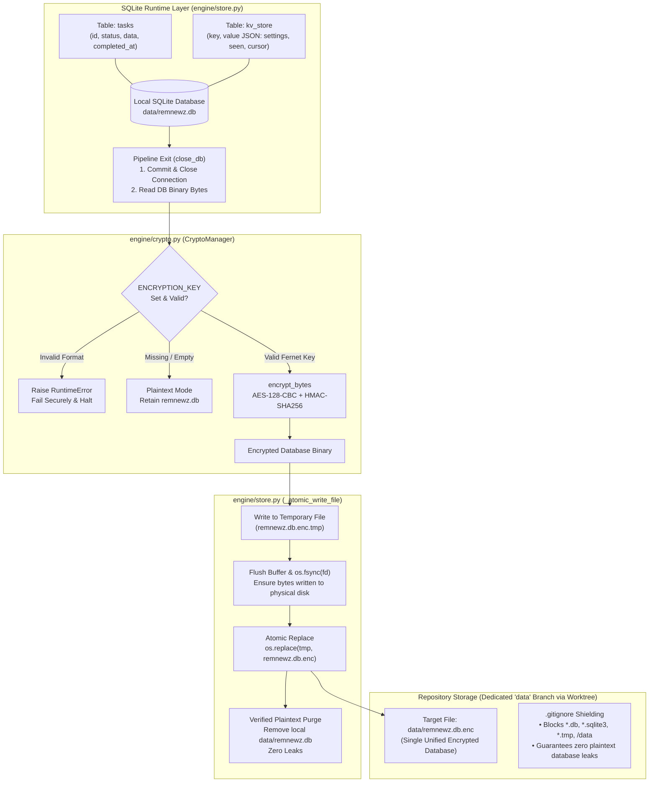
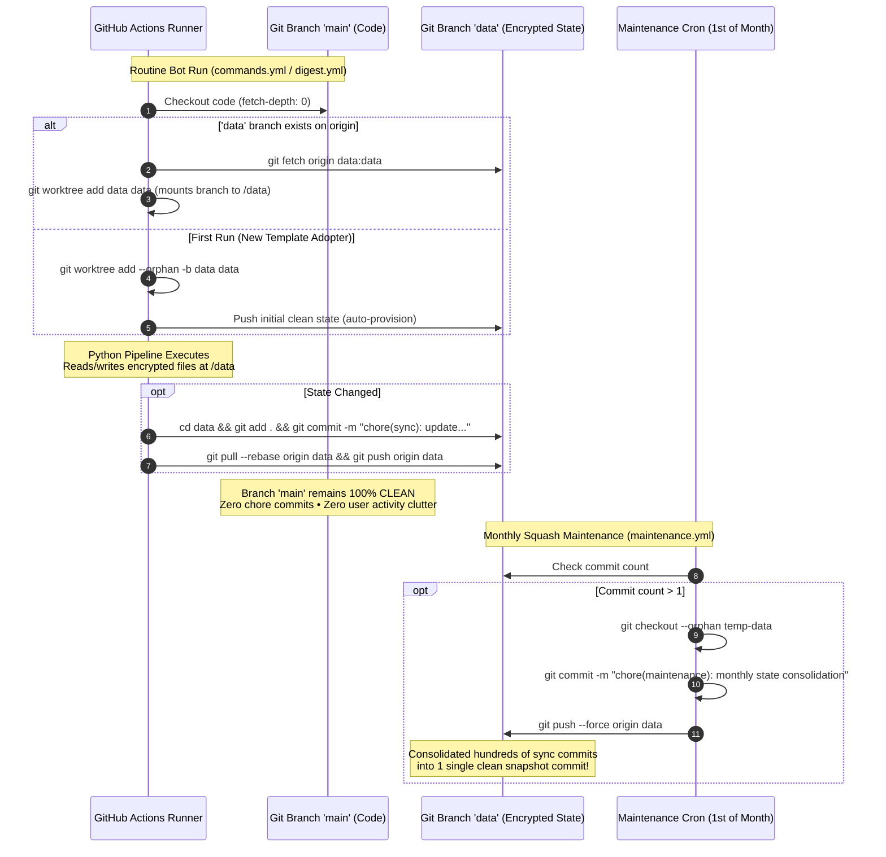

# RemNewz — System Structures & Architecture Diagrams

This document centralizes the visual architectural models and Mermaid sequence diagrams for **RemNewz**. It illustrates the system topology, end-to-end news ingestion flow, task management lifecycle, Cloudflare webhook sequence, persona decision routing, and storage encryption subsystem.

---

## 1. System Topology & Infrastructure Overview

RemNewz operates as an autonomous, serverless suite running on GitHub Actions with zero dedicated servers. It interacts with the Telegram Bot API for user communication and interfaces with pluggable AI providers for natural language synthesis.

---

## 2. End-to-End News Ingestion & Synthesis Flow (Newzy)

This diagram illustrates how Newzy discovers, filters, deduplicates, synthesizes, and delivers technical news both on a schedule and on-demand (`/digest`, `/news [query]`).

---

## 3. NLP Task Management & Anti-Spam Due Engine (Remzy)

This diagram details Remzy's task parsing pipeline, Fernet encryption at rest, proactive due notification engine, and 24-hour anti-spam snooze protection.

---

## 4. Cloudflare Worker Webhook Proxy Flow (Zero-Polling)

This sequence diagram illustrates the zero-polling webhook architecture for instant (<1s) Telegram responses without consuming GitHub Actions cron minutes.

---

## 5. Persona Decision Matrix & Scope Routing

This diagram models how incoming messages, forum supergroup threads, and Telegram API command scopes are evaluated and routed.

---

## 6. Storage & Cryptographic Architecture (Fail-Secure)

This diagram details the atomic file-write pattern and Fernet symmetric encryption mechanism safeguarding personal data in public and private repositories.

---

## 7. Dual-Branch Worktree & Monthly Squash Lifecycle

This diagram demonstrates how GitHub Actions mounts the dedicated `data` branch at runtime via Git Worktrees, commits state exclusively to `origin data`, auto-provisions for new template adopters, and runs monthly squash maintenance.

